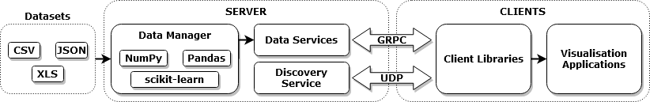

# ImmVis (Server)

This is the server side project from ImmVis, a platform that aims to connect different data visualization platforms to a data analysis service written in Python.

## Solution archictecture

The platform consists into a GRPC server that exposes some data analysis functions from Python, specifically from [Pandas](https://github.com/pandas-dev/pandas) and [scikit-learn](https://scikit-learn.org). The intent of this is to use Python data analysis capabilities on development environments that aren't to good for that.

Here is a really small architecture diagram about how it works:

## Setup

To develop for the server side, you should have installed [Python](https://www.python.org/) (3.6+) and [PIP](https://pypi.org/project/pip/) (latest version available). 

If you already have them installed, please install the Python dependencies listed at `requirements.txt` file. If you are not sure how to do that, please run or take a look at the scripts `install_python_dependencies.bat` (Windows) and `install_python_dependencies.sh` (Linux/MacOS) available on the `utilities` folder.

## Running the server

Currently there are two ways of running the server: 

* From the root directory of the project run the following command: `python -m immvis.grpc`
* Open the root folder with [Visual Studio Code](https://code.visualstudio.com/) and run the debug task `Python: Immvis Grpc`

## Loading datasets

The `LoadDataset` method is able to load datasets from any local path or remote URL but it's possible to configure the environment variable `IMMVIS_DATASETS` with a folder path to enable the method `ListAvailableDatasets` to get all the datasets available for that folder.

The supported formats are: CSV (with comma separator), XLS and JSON.

## Available Client Libraries:

* [Unity3D](https://github.com/imdavi/immvis-client-grpc-unity)

## Adding new features

If you are planning to add new features on the platform, please follow the following steps:

1. Create the required data structures or functions on the `proto/immvis.proto` file. If you want more information about how to do that, please check the [GRPC documentation](https://grpc.io/).
1. Run the python libs generation scripts (`generate_python_libs.bat` or `generate_python_libs.sh`) to transform the definitions from the `proto/immvis.proto` definitions into Python bindings. 
1. Extend the class `ImmVisServer` at `immvis/__main__.py` adding the functions created on the proto file. To have more details about how to use GRPC on Python please check this [link](https://grpc.github.io/grpc/python/). Please try to follow the implementation of current features for now, as there are plans to simplify the way of adding new features.
1. Generate the libs for the clients that you are willing to use. Currently, we only provide a script to generate libs for C#/Unity3D (`generate_csharp_libs.bat` or `generate_csharp_libs.sh`). After generating these files, copy them to your project.
